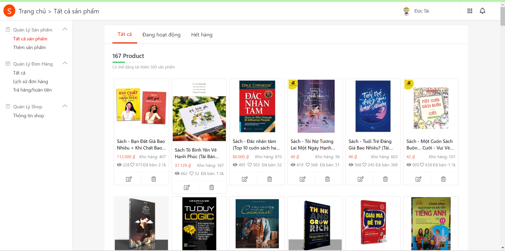

# https---github.com-HelloThien-shopeeclone


# Description 

Hiện thực trang shopee 

## Installation

Use the  [xampp](https://pip.pypa.io/en/stable/)  and clone git :

```bash
git clone https://github.com/HelloThien/shopeeclone.git
```

## Usage

 Import file shopcucmanh_dbi202.sql to mysql. 

And add folder single to  htdocs  in xampp. 

Then open    https://localhost/single  to run app. 

 
## Tree folder 


## view 
# Home 

# Product

# Cart 

# Detail

# Account

# Seller

# Prodcut of shop 

# Order


 

 
